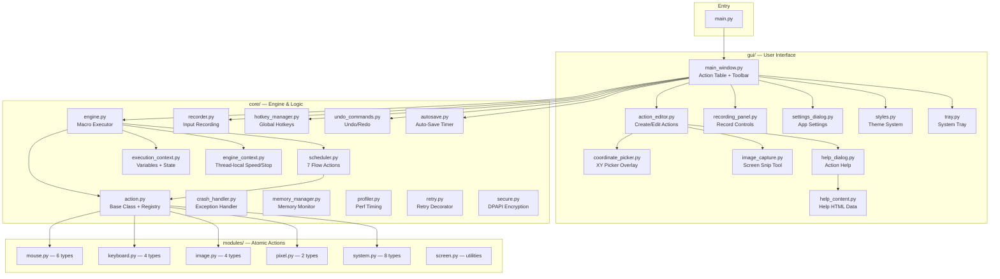

# Auto Mouse & Keyboard — Architecture Guide

> **Codebase**: 33 source files, ~200KB code, 31 registered action types
> **Framework**: PyQt6 (desktop), pyautogui + opencv (automation)

## Table of Contents
1. [System Overview](#system-overview)
2. [Core Layer](#core-layer)
3. [Modules Layer](#modules-layer)
4. [GUI Layer](#gui-layer)
5. [Action Registration & Import Order](#action-registration--import-order)
6. [Data Flow](#data-flow)
7. [Security Architecture](#security-architecture)
8. [Design Patterns](#design-patterns)
9. [File Size Map](#file-size-map)

---

## System Overview



---

## Core Layer

`core/` contains the engine, action model, and infrastructure services.

| File | Size | Key Classes/Functions | Purpose |
|------|------|----------------------|---------|
| `action.py` | 10KB | `Action`, `DelayAction`, `register_action()`, `audit_registry()` | Base class, registry, serialization |
| `engine.py` | 12KB | `MacroEngine` | Threaded macro execution (flat list) |
| `scheduler.py` | 26KB | `LoopBlock`, `IfImageFound`, `IfPixelColor`, `IfVariable`, `SetVariable`, `SplitString`, `Comment` | **7 flow control actions** (Composite Pattern) |
| `execution_context.py` | 8KB | `ExecutionContext` | Shared state: variables, image matches, stats |
| `engine_context.py` | 2KB | `set_speed()`, `get_context()`, `is_stopped()`, `scaled_sleep()` | Thread-local context helpers |
| `recorder.py` | 17KB | `Recorder` | Mouse + keyboard input recording |
| `hotkey_manager.py` | 7KB | `HotkeyManager` | Win32 RegisterHotKey integration |
| `undo_commands.py` | 5KB | `AddActionCommand`, `DeleteActionsCommand`, `ReorderActionsCommand` | Qt QUndoCommand for action list |
| `autosave.py` | 4KB | `AutoSaveManager` | Timer-based auto-save (60s default) |
| `crash_handler.py` | 5KB | `CrashHandler` | Global sys.excepthook replacement |
| `memory_manager.py` | 7KB | `MemoryManager` | Memory monitoring + cleanup callbacks |
| `profiler.py` | 3KB | `PerformanceProfiler`, `get_profiler()` | Context-manager timing tracker |
| `retry.py` | 2KB | `retry()` decorator | Exponential backoff retry for transient failures |
| `secure.py` | 2KB | `encrypt()`, `decrypt()`, `is_encrypted()` | Windows DPAPI encryption for passwords |

---

## Modules Layer

`modules/` registers **24 atomic action types** via `@register_action()`.
Each module is imported at startup in `gui/main_window.py`.

| Module | Types | Count | Notes |
|--------|-------|-------|-------|
| `mouse.py` | mouse_click, mouse_double_click, mouse_right_click, mouse_move, mouse_drag, mouse_scroll | 6 | pyautogui-based |
| `keyboard.py` | key_press, key_combo, type_text, hotkey | 4 | pyautogui + keyboard lib |
| `image.py` | wait_for_image, click_on_image, image_exists, take_screenshot | 4 | OpenCV template matching |
| `pixel.py` | check_pixel_color, wait_for_color | 2 | Single-pixel fast check |
| `system.py` | activate_window, log_to_file, read_clipboard, read_file_line, write_to_file, secure_type_text, run_macro, capture_text | 8 | Window mgmt, file I/O, OCR |
| `screen.py` | *(no registered types)* | 0 | Screenshot utilities |

> **7 additional** flow control types are in `core/scheduler.py` (NOT modules/).
> **Total: 31 registered types** across all files.

---

## GUI Layer

| File | Size | Key Classes | Purpose |
|------|------|-------------|---------|
| `main_window.py` | 68KB | `MainWindow` | Main app: action table, toolbar, log panel, drag-drop |
| `action_editor.py` | 43KB | `ActionEditor` | Create/edit dialog: per-type param builders |
| `settings_dialog.py` | 12KB | `SettingsDialog` | Hotkeys, speed, defaults, paths |
| `recording_panel.py` | 10KB | `RecordingPanel` | Record/pause/stop controls |
| `coordinate_picker.py` | 9KB | `CoordinatePickerOverlay` | Full-screen crosshair + magnifier + color preview |
| `help_dialog.py` | 7KB | `HelpPopup` | Floating help window for action types |
| `help_content.py` | 37KB | `_ACTION_HELP` dict | Rich HTML help text with scenarios for all 31 types |
| `styles.py` | 12KB | `DARK_COLORS`, `get_stylesheet()` | Theme palette + QSS template engine |
| `tray.py` | 4KB | `SystemTrayManager` | System tray icon with state-colored indicator |
| `image_capture.py` | 5KB | `ImageCaptureOverlay` | Screen snipping for image templates |

---

## Action Registration & Import Order

> ⚠️ **CRITICAL**: Import order determines which registration wins.
> If two files register the same `action_type`, the **LAST import wins** silently.
> `register_action()` now warns in log when a type is overwritten.

```python
# gui/main_window.py — import order (ALL modules must be imported here)
import modules.mouse        # 6 types
import modules.keyboard     # 4 types
import modules.image        # 4 types
import modules.pixel        # 2 types
import modules.system       # 8 types
import core.scheduler        # 7 types ← MUST be last (flow control)
```

**Rules:**
1. Each `action_type` string must be **globally unique** across ALL files
2. `register_action()` logs `WARNING` if a type is registered twice
3. Call `audit_registry()` at startup to verify (done in `main.py`)
4. **NEVER** create duplicate `@register_action()` for types already in `scheduler.py`

---

## Data Flow

### Create Action (User → Storage)
```
ActionEditor._on_type_changed()
    → _build_*_params() creates widgets
    → _collect_params() reads widget values → dict
    → get_action_class(type)(**params) → Action instance
    → MainWindow._actions.append(action)
    → QTableWidget row updated
    → engine.save_macro() → JSON file
```

### Execute Macro (Play)
```
MainWindow._on_play()
    → MacroEngine.load_actions(deep_copy of _actions)
    → QThread: engine._run_action_list()
        → for action in actions:
            action.run()  → execute() + delay + repeat
            ├── Atomic: mouse.click, key.press, etc
            └── Composite: LoopBlock.execute()
                ├── for i in range(N):
                │   for sub in _sub_actions:
                │       sub.run()  ← recursive!
                └── IfImageFound.execute()
                    ├── found → run _then_actions
                    └── not_found → run _else_actions
```

### Record (Input → Actions)
```
RecordingPanel → Recorder.start()
    → pynput listeners (mouse + keyboard)
    → Events filtered (skip hotkeys, debounce)
    → Recorder.stop()
    → List of Action objects
    → MainWindow._actions.extend(recorded)
```

### Import/Export (JSON)
```
Save: action.to_dict() → {"type": "loop_block", "params": {..., "sub_actions": [...]}}
Load: Action.from_dict(data) → recursive deserialization
Format: {"version": "1.x", "actions": [...], "settings": {...}}
```

---

## Security Architecture

```
User enters password in ActionEditor
    → SecureTypeText.__init__(encrypted_text=...)
    → core.secure.encrypt(password)  → "DPAPI:base64blob"
    → Stored encrypted in macro JSON
    → At runtime: core.secure.decrypt() → plaintext
    → pyautogui.typewrite(plaintext)
    → Log shows "****" only
```

**Implementation**: Windows DPAPI (`win32crypt.CryptProtectData`)
- Encrypted data is machine-bound (cannot decrypt on another PC)
- Fallback: plaintext if `win32crypt` not available
- Prefix: `"DPAPI:"` identifies encrypted values

---

## Design Patterns

| Pattern | Where | Purpose |
|---------|-------|---------|
| **Command** | `Action` subclasses | Each action = self-contained command with execute/undo |
| **Registry** | `@register_action()` + `_ACTION_REGISTRY` | Type string → class lookup |
| **Composite** | `LoopBlock`, `IfImageFound`, `IfVariable`, `IfPixelColor` | Actions contain child action lists |
| **Builder** | `ActionEditor._build_*_params()` | Per-type widget construction |
| **Singleton** | `MemoryManager.instance()`, `get_profiler()` | Global singletons for services |
| **Observer** | Qt signals/slots throughout GUI | Loose coupling between components |
| **Decorator** | `@retry()`, `@register_action()` | Cross-cutting behavior |
| **Template Method** | `Action.run()` calls `execute()` | Base handles delay/repeat, subclass handles logic |
| **Strategy** | `_ACTION_HELP`, `ACTION_CATEGORIES` | Data-driven help and categories |

---

## File Size Map

File sizes indicate complexity and maintenance burden:

```
68KB  gui/main_window.py        ██████████████████████████████████ ← Largest, needs refactoring
43KB  gui/action_editor.py      ██████████████████████
37KB  gui/help_content.py       ███████████████████
26KB  core/scheduler.py         █████████████
19KB  modules/system.py         ██████████
19KB  modules/image.py          ██████████
17KB  core/recorder.py          █████████
12KB  gui/settings_dialog.py    ██████
12KB  gui/styles.py             ██████
12KB  core/engine.py            ██████
10KB  core/action.py            █████
10KB  gui/recording_panel.py    █████
10KB  modules/mouse.py          █████
 9KB  gui/coordinate_picker.py  █████
 8KB  core/execution_context.py ████
 7KB  core/hotkey_manager.py    ████
 7KB  gui/help_dialog.py        ████
 7KB  core/memory_manager.py    ████
 7KB  modules/keyboard.py       ████
 6KB  modules/pixel.py          ███
 5KB  core/undo_commands.py     ███
 5KB  core/crash_handler.py     ███
 5KB  gui/image_capture.py      ███
 5KB  main.py                   ███
 4KB  gui/tray.py               ██
 4KB  modules/screen.py         ██
 4KB  core/autosave.py          ██
 3KB  core/profiler.py          ██
 2KB  core/retry.py             █
 2KB  core/engine_context.py    █
 2KB  core/secure.py            █
 2KB  scripts/bump_version.py   █
 0KB  version.py                ▏
```
