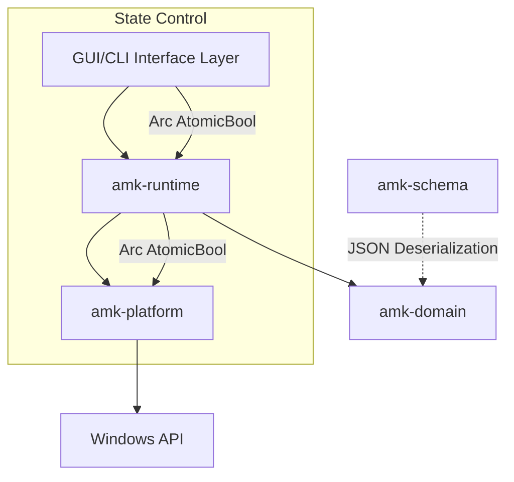

# AutoMacro System Architecture

> [!IMPORTANT]
> The AutoMacro system has transitioned from a localized Python 3 Scripting prototype to a fully compiled, typed, and segmented Rust Application (`rust-app/`). Future developers and AI Agents must reference this document before making any codebase adjustments.

## Core Design Principles
1. **Decoupled Architecture**: Serialization, Logic, and Execution are physically isolated into independent Rust Crates (Workspaces).
2. **Deterministic Cancellation**: Immediate cancellation of running macros without killing the OS thread or waiting for blocking Win32 sleeps.
3. **Rust Memory & FFI Safety**: No unbounded or raw Win32 handles exposed without RAII drops.

## Architectural Layers (Cargo Workspaces)

The `rust-app` project directory hosts multiple crates connected via Cargo Workspace.



### 1. The Serialization Layer (`amk-schema`)
Pure structural layout of the JSON macro data. Defines elements strictly as string constants or primitive data without verification. Contains zero business logic, enabling easy expansion if AutoMacro imports different format types.

### 2. The Verification Layer (`amk-domain`)
Verifies incoming raw Schema blocks and parses them into memory-safe types (e.g., converting "left" to Enum `MouseButton::Left`, ensuring coordinates are valid boundaries). Outputs an actionable node tree (`TypedAction`).

### 3. The Engine Layer (`amk-runtime`)
Handles the iterative state loop:
- Ingestion of `Domain` structures.
- Processing logical trees (Composite, Loops, Infinite retries).
- Interpreting delay timers according to `speed_factor`.
- **Requires zero understanding of the operating system**.

### 4. The Platform Layer (`amk-platform`)
The bridge between `amk-runtime` and Windows:
- Wraps `windows-sys` external APIs cleanly.
- Responsible for injecting keystrokes, dragging mouse inputs, and capturing GDI Bitmaps.
- Enforces strict RAII resource drops. No null handles are ignored.

### 5. The Application Layer (`amk-gui` / `amk-cli`)
Hosts the presentation structure.
- `amk-gui` is built on top of `eframe` (egui) rendering. It hosts the persistent Macro App state, spawns the independent Engine logic worker inside `std::thread`, and synchronizes state via `AtomicBool` polling.

## Build Configuration (CRITICAL)

### Linker: MSYS2 UCRT GCC
The workspace uses `.cargo/config.toml` to configure the MSYS2 UCRT GCC linker (`C:/Ruby40-x64/msys64/ucrt64/bin/gcc.exe`). The main thread stack is set to 16MB via `-Wl,--stack,16777216`.

> [!CAUTION]
> **NEVER use `-Clink-self-contained=yes` or `rust-lld` as linker.** Rust's self-contained MinGW CRT has a fatal TLS initialization bug that causes `STATUS_STACK_OVERFLOW` (0xc00000fd) crashes during CRT startup — BEFORE `main()` is reached. This is not solvable by increasing stack size; the CRT code itself has infinite recursion.

### Build Commands
```bash
cargo run -p amk-gui          # GUI (debug with console)
cargo run -p amk-cli -- run X  # CLI execution
cargo test --workspace         # All tests
cargo build --release -p amk-gui  # Release build
```

## Crucial Implementation Details

### The SmartSleeper Paradigm
Win32 Automation suffers from massive delays. If an action states `Wait 60_000ms`, a naive backend locks the processor (`thread::sleep`) for 60 seconds. AutoMacro avoids this by employing a `SmartSleeper`. 
Instead of a continuous block, the platform layer splits the 60,000ms delay into consecutive `15ms` yield steps. At every single tick, `SmartSleeper` inspects the globally shared `stop_flag`. If the user hits "Stop", the 60-second block is instantly exited within a `<15ms` threshold.

### Strict Input Monitoring
`SendInput` can be blocked by UAC prompts or Anti-cheat applications. AutoMacro does not fake success. It logs the return count from Win32 and immediately returns `Err` to the Execution chain, ensuring macro progression stops gracefully when inputs are jammed.

## Migration Note (Python Legacy)
The original Python application (`/core/`, `/gui/`, `/scripts/`) using PyAutoGUI/cv2 is deprecated. All new code MUST be generated inside the `rust-app/` workspace.
